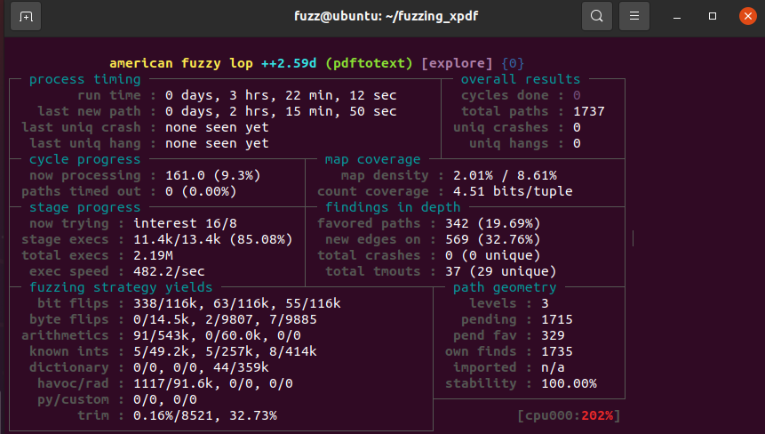
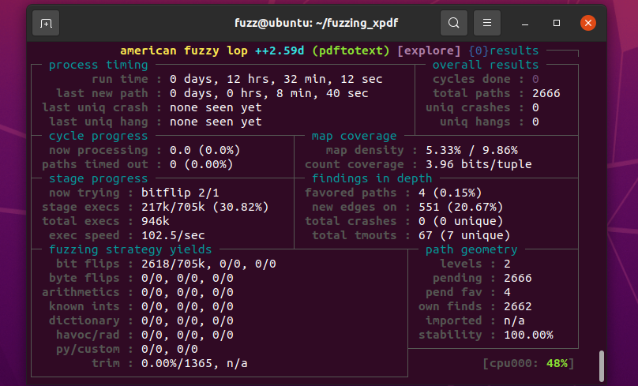
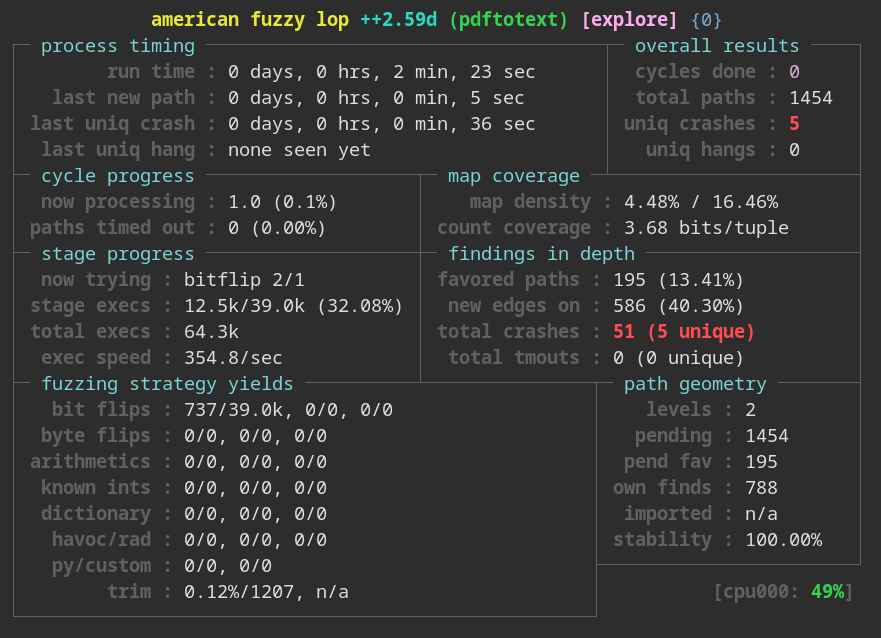
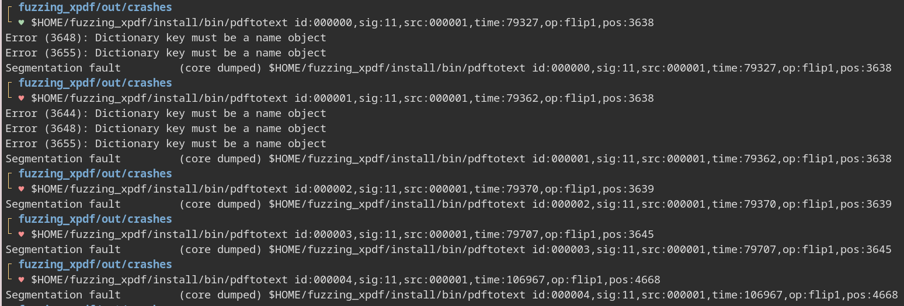

# Exercise 1 - Xpdf

This exercise fuzzes Xpdf PDF viewer to find a crash/PoC for [CVE-2019-13288](https://www.cvedetails.com/cve/CVE-2019-13288/) in XPDF 3.02. 

CVE-2019-13288 is a vulnerability that may cause an infinite recursion via a crafted file. Since each called function in a program allocates a stack frame on the stack, if a a function is recursively called so many times it can lead to stack memory exhaustion and program crash.As a result, a remote attacker can leverage this for a DoS attack.

## Setup

I ran this exercise in the provided [20.04.2 Ubuntu LTS VMware image](https://drive.google.com/file/d/1_m1x-SHcm7Muov2mlmbbt8nkrMYp0Q3K/view?usp=sharing).

I followed the instructions provided to download necessary tools and build Xpdf. Of the recommended initial PDF examples, the last two (from africau.edu and melbpc.org.au) did not exist: as a result, I used a [sample PDF](https://ontheline.trincoll.edu/images/bookdown/sample-local-pdf.pdf) from Trinity College in additionto the first hello world PDF.

I installed AFL++ via `sudo apt install afl++` instead of the provided Docker or local methods. 

## Fuzzing for Crashes

I ran AFL++ with the following command:

```
afl-fuzz -i ./pdf_examples/ -o ./out/ -s 123 -- /home/fuzz/fuzzing_xpdf/install/bin/pdftotext @@ /home/fuzz/fuzzing_xpdf/output
```

I then realized, I forgot to set more cores per processor for my VMware machine. Rather than stopping the process (hello, sunk cost fallacy), I decided to step away from my computer since I had some evening plans. I came back when AFL++ had run for almost 3.5 hours, resulting in 1737 paths, with the last path discovered more than 2 hours ago. For comparison, the original tutorial took about 18 minutes to find 2069 paths, including the path that crashed (though this is also likely due to differences in the PDF examples we had).



Since it had been more than two hours since the last path discovered, I quit the program, set the number of cores per processor from 2 to 8, and continued to fuzz (I used `-i-` instead of `-i ./pdf_examples` to continue from where I left off previously). I let the fuzzer run for another hour or two (with 1830 paths discovered), when I decided to try to add two more example PDFs. [One](https://dagrs.berkeley.edu/sites/default/files/2020-01/sample.pdf) of these had contents and Latex samples and the [other](https://www.adobe.com/support/products/enterprise/knowledgecenter/media/c4611_sample_explain.pdf) had tables and an image. I hoped that this variety would help with exploring new paths.

I tried to copy these examples to `out/queue` in order to get AFL++ to start with additional examples (while saving progress): this did not go as expected, and started restarted the fuzzing process for me. I ended up fuzzing overnight, still without much success:



To speed up the process, I re-set up the fuzzing process in a distrobox rather than a VM. I also choose more diverse example PDFs. I pulled PDFs from a [fuzzing repository](
https://github.com/ant4g0nist/fuzzing-pdfs-like-its-1990s) and used only files smaller than 50KB. This was successful: I found five crashes within 2 minutes.





## Debugging and Fixing 

I used gdb in order to debug these crashes.

### Crash 1

### Crash 2

### Crash 3

### Crash 4